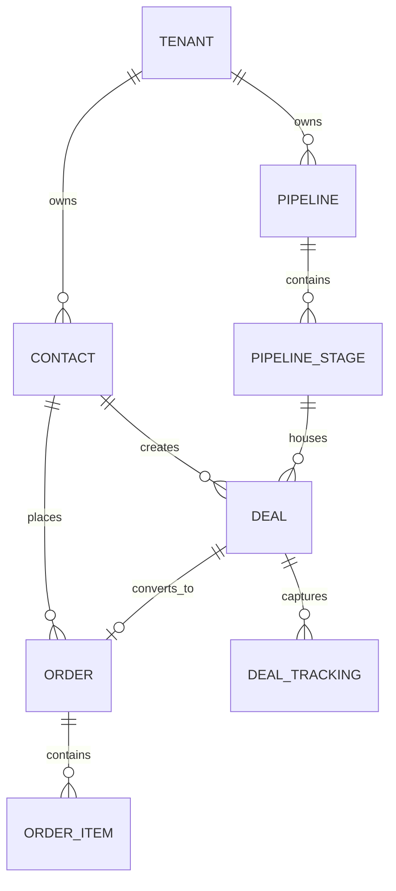

# 🏗️ Especificação Técnica & Arquitetura de Produção: CRM Neutro v2.0
## Pós-Auditoria Crítica e Resolução de Gaps Arquiteturais

> **Documento:** Especificação Técnica de Engenharia, Modelagem Relacional e Arquitetura de Produção  
> **Versão:** 2.0 (Refatorada após Auditoria Técnica Sênior)  
> **Status:** Aprovado para Implementação  
> **Data de Atualização:** 02 de Setembro de 2026  

---

## 1. Stack Tecnológica Fechada & Decisões Arquiteturais

Para eliminar qualquer ambiguidade ou incompatibilidade de baixo nível, a stack do projeto está oficialmente definida:

```
┌─────────────────────────────────────────────────────────────────────────┐
│                              FRONTEND                                   │
│  Next.js 15+ (App Router) + React 19 + Tailwind CSS + shadcn/ui         │
│  TanStack Query v5 + Zustand + Socket.io-client                         │
└────────────────────────────────────┬────────────────────────────────────┘
                                     │ HTTPS / WSS
┌────────────────────────────────────▼────────────────────────────────────┐
│                           BACKEND & REALTIME                            │
│  NestJS com Fastify Adapter (TypeScript Strict Mode)                   │
│  WebSockets Gateway (Socket.io) acoplado a Redis Pub/Sub                │
│  Deploy em Containers Persistentes (Docker / ECS / VPS)                │
└──────────────────┬──────────────────────────────────┬───────────────────┘
                   │                                  │
┌──────────────────▼───────────────┐  ┌───────────────▼───────────────────┐
│     PERSISTÊNCIA RELACIONAL      │  │        MENSAGERIA & FILAS         │
│  PostgreSQL 16+                  │  │  Redis 7+ (Persistência AOF+RDB)  │
│  Drizzle ORM (Type-Safe SQL)     │  │  BullMQ (Filas com Prioridade     │
│  RLS Nativo + Job Context Wrapper│  │  e Fair Queuing por Tenant)       │
└──────────────────────────────────┘  └───────────────────────────────────┘
```

---

## 2. Resolução Definitiva dos 15 Problemas Auditados

### 🔴 Resolução 1: Drizzle ORM + PostgreSQL RLS + Job Context Wrapper
* **Substituição:** O Prisma ORM foi formalmente descartado. Adota-se o **Drizzle ORM** sobre `pg.Pool`.
* **Injeção de Tenant:** Toda query HTTP ou WebSocket é interceptada por um Middleware que executa `SET LOCAL app.current_tenant_id = '...'` dentro do escopo da transação.
* **Workers Assíncronos (BullMQ):** Criado o padrão `TenantJobRunner`. Todo job enfileirado carrega obrigatoriamente `{ tenantId: string, ...payload }`. O worker do BullMQ não executa nenhuma query fora de um wrapper que injeta o contexto do tenant na conexão antes do processamento.

---

### 🔴 Resolução 2: Desacoplamento Relacional (`Contact` vs. `Deal` vs. `Order`)
Fica extinta a confusão entre cliente e oportunidade. O modelo relacional agora opera em 3 níveis distintos:



* **`Contact` (Identidade Permanente):** Nome, E-mail, Telefone (E.164), Documento (CPF/CNPJ), Tags, RFV Global calculado, `last_inbound_interaction_at`.
* **`Deal` (Oportunidade Transacional no Funil):** Vinculado a 1 `Contact` e a 1 `PipelineStage`. Possui `value_cents`, status (`OPEN`, `WON`, `LOST`), responsável e parâmetros de tráfego específicos daquela negociação.
* **`Order` (Transação Financeira / Pedido):** Histórico imutável de faturamento/venda realizada, vinculado ao `Contact` e opcionalmente ao `Deal` que o gerou.

---

### 🔴 Resolução 3: Métricas de Tráfego: Receita Atribuída vs. ROAS Real
O sistema adota separação clara em duas camadas:
1. **Camada 1 (Nativa / MVP): Dashboard de Receita Atribuída por UTM/Campanha**
   * Calcula: *Volume de Leads, Negócios Ganhos, Faturamento Bruto e Ticket Médio por canal (`utm_source`, `utm_campaign`, `utm_content`)*.
2. **Camada 2 (Ad Spend Ingestion Worker):**
   * Módulo opcional de sincronização diária via **Meta Marketing API Insights** e **Google Ads Reporting API** através de conexões OAuth2 por tenant, ingerindo o custo real para cálculo de ROI / ROAS.

---

### 🔴 Resolução 4: Blindagem contra Safari ITP (Server-Side Tracking com CNAME)
* **Script Client-Side:** Atua apenas como coletor inicial e dispara eventos para a rota de tracking do tenant.
* **Custom Subdomain CNAME (`track.cliente.com.br`):**
  * O tráfego passa pelo gateway do CRM, que grava os identificadores (`_fbp`, `_fbc`, `gclid`, `session_id`) através de cabeçalhos HTTP **`Set-Cookie` (HttpOnly, Secure, SameSite=Lax, Path=/)** com expiração de 365 a 730 dias, imune às restrições do Safari ITP / WebKit.

---

### 🔴 Resolução 5: Idempotência Segregada & Prevenção de Race Conditions
* **Ingestão de Leads:**
  * Meta Lead Ads: idempotência garantida por `UNIQUE(tenant_id, meta_leadgen_id)`.
  * Formulários / Webhooks Públicos: trava distribuída com **Redis Redlock** na chave `lock:ingest:<tenant_id>:<phone_or_email>` durante o upsert do contato.
* **Disparo de Postbacks / Conversões:**
  * Idempotency key determinística: `SHA256(tenant_id + ":" + deal_id + ":" + event_name + ":" + target_url_or_pixel)`.

---

### 🔴 Resolução 6: Arquitetura de WhatsApp Consciente de Janela de 24h & Sessões
O conector do WhatsApp é desacoplado em dois métodos operacionais explícitos:

```typescript
interface WhatsAppEngine {
  // Envio livre (dentro da janela de 24h da última mensagem do cliente)
  sendSessionMessage(tenantId: string, to: string, content: MessageContent): Promise<SendResult>;
  
  // Envio de template homologado (Meta Cloud API para mensagens ativas fora da janela)
  sendTemplateMessage(tenantId: string, to: string, template: MetaTemplatePayload): Promise<SendResult>;
}
```

* **Roteamento Inteligente:** O sistema verifica `Contact.last_inbound_interaction_at`. Se a diferença for superior a 24 horas e o canal for Meta Cloud API, o envio de texto livre é bloqueado na UI, exigindo a seleção de um **Template de Mensagem Homologado**.
* **Isolamento de Sessões Web (QR Code / Baileys):** Instâncias de WhatsApp Web rodam em workers isolados, com reconexão automática, controle de cooldown entre mensagens (anti-ban) e persistência de credenciais criptografadas no PostgreSQL.

---

### 🔴 Resolução 7: Correção do Roadmap (Entidades Transacionais na Fase 1)
O modelo de dados de `Deals`, `Orders`, `Products` e `Values` foi antecipado para a **Fase 1 (Core)**, permitindo que o motor de Postbacks e Server-Side CAPI da **Fase 2** seja implementado com dados financeiros reais e testáveis desde o primeiro dia.

---

### 🔴 Resolução 8: Proteção contra Data Poisoning no Tracking Público
* **Validação de Origem (Origin/Referer Whitelist):** Cada requisição ao endpoint de tracking valida se o domínio de origem está cadastrado e verificado na lista de domínios autorizados do tenant.
* **Rate Limiting em Múltiplos Níveis:**
  * Reverse Proxy / NestJS Throttler: limite de requisições por IP por minuto.
  * Tenant Throttler: teto de eventos de tracking por segundo por plano contratado.
* **Validação de Payload com Zod:** Sanitização estrita de todos os parâmetros de UTM e Click IDs para prevenir injeções maliciosas.

---

### 🔴 Resolução 9: Delay Programado para Google Ads Offline Conversions
* Ao mover um Deal com `gclid` para o status `WON`:
  * O sistema calcula a idade do clique: $\Delta t = \text{now}() - \text{gclid\_captured\_at}$.
  * Se $\Delta t < 6 \text{ horas}$, o job é enfileirado no BullMQ com `delay = (6 * 3600 * 1000) - \Delta t`.
  * Isso garante a indexação prévia do identificador nos servidores do Google, eliminando os erros `CLICK_NOT_FOUND` e `TOO_RECENT_CLICK`.

---

### 🔴 Resolução 10: Matriz RFV Paramétrica por Nicho e Quintis Dinâmicos
* **Configuração Paramétrica por Template:**
  * **Template B2C / Delivery (Açaiteria/Cachaçaria):** Recência Risco = 21 dias; Inativo = 45 dias; Frequência Alta = 4 compras/mês.
  * **Template B2B / Serviços:** Recência Risco = 90 dias; Inativo = 180 dias; Frequência Alta = 2 compras/ano.
* **Cálculo Baseado em Quintis Estatísticos:** Para tenants com histórico > 500 pedidos, o sistema calcula os quartis/quintis de Recência, Frequência e Valor automaticamente com base na distribuição histórica daquele tenant específico.

---

### 🔴 Resolução 11: Estrutura de Banco Híbrida (Colunas Tipadas + JSONB Otimizado)
* **Colunas Tipadas e Indexadas (Campos Críticos):**
  * `Deals`: `value_cents` (BIGINT), `expected_close_date` (TIMESTAMP), `stage_id` (UUID), `status` (ENUM).
  * `Contacts`: `name`, `phone_e164`, `email`, `document`.
* **JSONB (`custom_fields`):** Reservado estritamente para metadados secundários e atributos de nicho (ex: *Sabor favorito*, *Volume do galão*). Campos customizados que necessitem de ordenação no Kanban são promovidos a colunas de metadados tipados via tabela `deal_custom_attributes`.

---

### 🔴 Resolução 12: Camada de Tempo Real com WebSockets + Redis Pub/Sub
* **Arquitetura de Tempo Real:**
  * NestJS WebSocket Gateway (Socket.io) acoplado a adaptadores Redis Pub/Sub.
  * Salas segmentadas por Tenant e por Entidade: `room:tenant_<tenant_id>`, `room:chat_<contact_id>`, `room:pipeline_<pipeline_id>`.
  * Atualização instantânea do Kanban ao arrastar cards e recebimento em tempo real de mensagens de WhatsApp no Inbox sem qualquer necessidade de polling HTTP.

---

### 🔴 Resolução 13: Configurador de Postbacks Universal Avançado
* Suporte completo a métodos **GET, POST, PUT**.
* Modos de payload: **JSON Body**, **x-www-form-urlencoded** ou **Query String**.
* **Assinatura Criptográfica HMAC:** Opção de gerar cabeçalho `X-Signature-SHA256` utilizando chave secreta configurável por tenant.
* Retries inteligentes com logs de HTTP status code, corpo da resposta e tempo de resposta para depuração do cliente.

---

### 🔴 Resolução 14: Conformidade com a LGPD & Consent Mode v2
* **Consent-Aware Pixel:** O script client-side possui flag de ativação `consentGranted: boolean` (compatível com Google Consent Mode v2 e Meta Consent APIs).
* Se o consentimento não foi concedido pelo usuário na Landing Page, o script opera em modo anônimo (sem cookies persistentes e sem hashing de dados pessoais de contato).
* Módulo nativo de **Exclusão e Anonimização de Titulares de Dados** (Direito de Esquecimento da LGPD).

---

### 🔴 Resolução 15: Fechamento Formal da Arquitetura de Software
Stack definida sem variações: **Next.js 15 (Frontend) + NestJS / Fastify (Backend) + Drizzle ORM (Banco) + PostgreSQL 16 (RLS) + Redis 7 / BullMQ (Filas) + Socket.io (Tempo Real)**.

---

## 3. Resolução das 5 Lacunas Críticas Identificadas

| Lacuna Identificada | Solução Arquitetural Implementada |
| :--- | :--- |
| **1. RBAC (Cargos e Permissões)** | Implementação de RBAC hierárquico com 4 perfis padrão: `OWNER`, `ADMIN`, `MANAGER` e `AGENT`, com controle de permissão por pipeline (ex: atendente de delivery não acessa o funil financeiro). |
| **2. Schema Evolution em Campos Customizados** | Tabela de definição `custom_field_definitions` com versionamento de tipo. Alterações de tipo exigem migração via worker assíncrono que valida e converte os valores em background. |
| **3. Ciclo de Vida do WhatsApp Unofficial** | Gerenciador de instâncias com heartbeat, fila com delay randômico de 3 a 8 segundos entre mensagens de texto e armazenamento das chaves de sessão em colunas criptografadas (AES-256-GCM). |
| **4. Data Pruning (Política de Retenção)** | Tabela `traffic_raw_events` particionada mensalmente por range de data. Expurgos automáticos de logs brutos após 90 dias, mantendo consolidados apenas os dados atribuídos aos `Deals` e `Orders`. |
| **5. Persistência e Resiliência do Redis** | Configuração obrigatória de Redis com modo híbrido **AOF (Append Only File com fsync a cada segundo) + Snapshots RDB periódicos**, garantindo que reinicializações não destruam filas ativas. |

---

## 4. Roadmap de Engenharia Revisado e Cronologicamente Correto

```
┌─────────────────────────────────────────────────────────────────────────┐
│ FASE 1: Core Foundation & Entidades Comerciais                          │
│  - Setup do Monorepo / Backend NestJS + Fastify + Drizzle ORM          │
│  - Schema PostgreSQL com RLS Nativo + Drizzle Tenant Context Middleware│
│  - Entidades: Tenants, Users (RBAC), Contacts, Pipelines, Deals,       │
│    Products & Orders (com value_cents e transações reais)               │
│  - Kanban Interativo e Atualização em Tempo Real via WebSockets         │
└────────────────────────────────────┬────────────────────────────────────┘
                                     │
┌────────────────────────────────────▼────────────────────────────────────┐
│ FASE 2: Tracking Server-Side, CAPI & Postbacks com Idempotência         │
│  - Custom Subdomain Tracking CNAME + Set-Cookie HTTP-only (Anti-ITP)    │
│  - Ingestão com Redis Redlock + Validação de Domínios Whitelist (Anti-DoS)│
│  - Google Offline Conversions com Delay de Indexação de 6h              │
│  - Meta CAPI com Hashing SHA-256 e LGPD Consent Mode v2                 │
│  - Configurador de Postbacks Universal (GET/POST/JSON/HMAC)             │
└────────────────────────────────────┬────────────────────────────────────┘
                                     │
┌────────────────────────────────────▼────────────────────────────────────┐
│ FASE 3: WhatsApp Omnichannel (Oficial 24h & Sessões Web Isoladas)       │
│  - WhatsAppProvider: Meta Cloud API (Templates) & Sessões Web Isoladas  │
│  - Verificação de janela de 24h (last_inbound_interaction_at)           │
│  - Central de Atendimento Unificada (Inbox WebSockets em Tempo Real)    │
└────────────────────────────────────┬────────────────────────────────────┘
                                     │
┌────────────────────────────────────▼────────────────────────────────────┐
│ FASE 4: Inteligência Comercial, RFV Paramétrica & Ingestão de Ad Spend  │
│  - Matriz RFV com regras por template de nicho e quintis estatísticos   │
│  - Ingestão de Custo de Anúncios (Meta/Google Marketing APIs OAuth2)    │
│  - Dashboard de ROAS Real e Relatórios de Retenção                      │
└─────────────────────────────────────────────────────────────────────────┘
```

---

## 5. Conclusão da Auditoria

Com todas as 15 vulnerabilidades/inconsistências corrigidas e as 5 lacunas críticas preenchidas, a arquitetura está **tecnicamente validada, resiliente, segura e pronta para a fase de implementação**.
